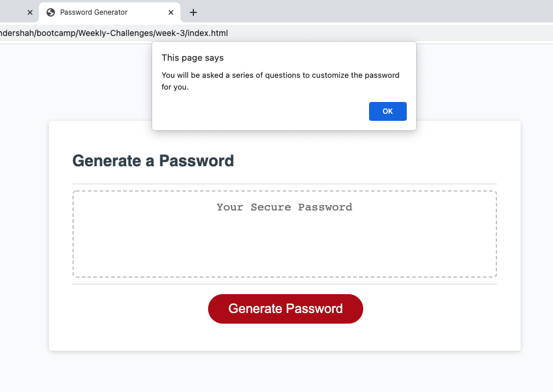
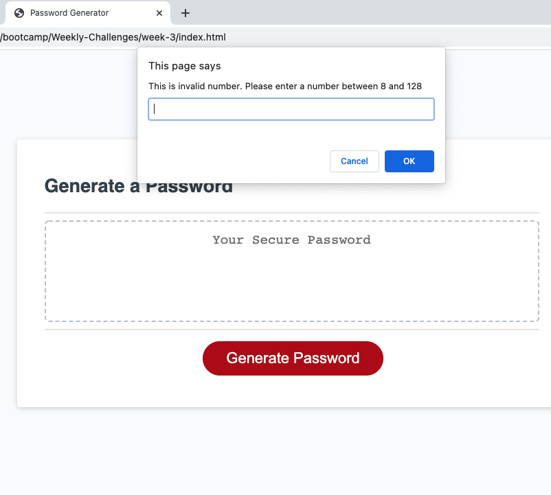
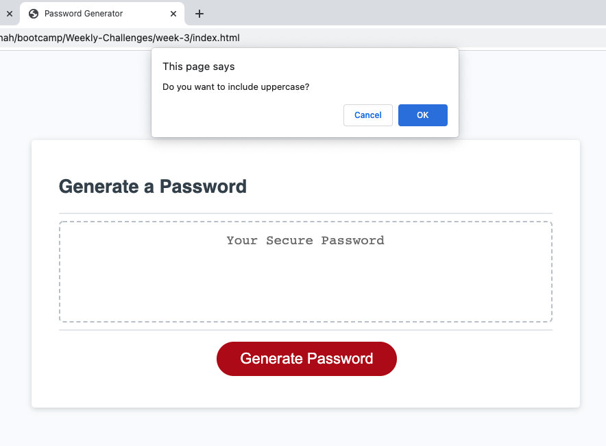
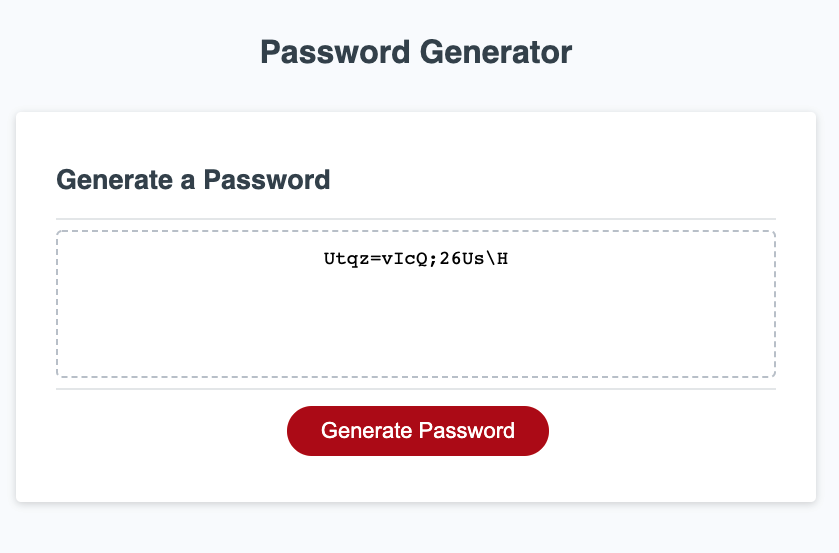

# password-generator

## [Password Generator Url](https://harry-100.github.io/password-generator/)

## [Project Url](https://github.com/harry-100/password-generator)

## Brief Overview

This application generates a unique customized password based on user preferences.
Following are the key considerations:
* the length of the password is between 8 and 128 characters.

* the user is asked to choose if they want to include:
    * lowercase alphabets
    * uppercase alphabets
    * numerals
    * special characters

* The program checks for the length of the password and that at least one option is selected for the character types to be included.

* Based on the user inputs, a  customized password is generated.

## Screenshots of the application

